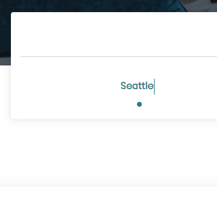
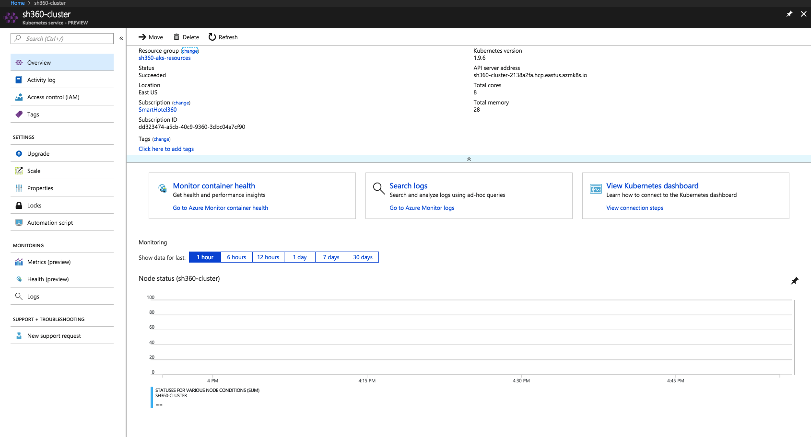
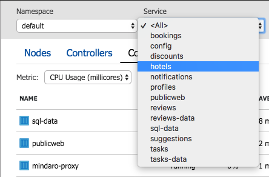
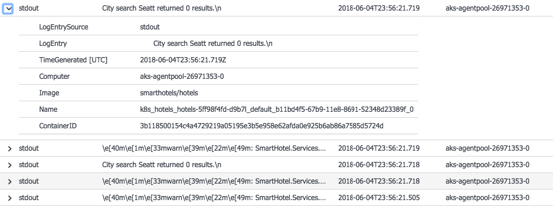
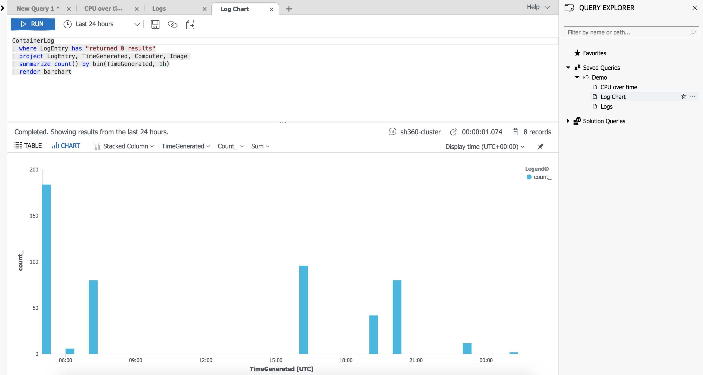
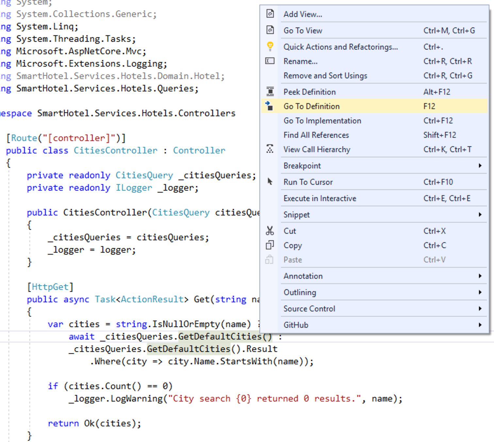
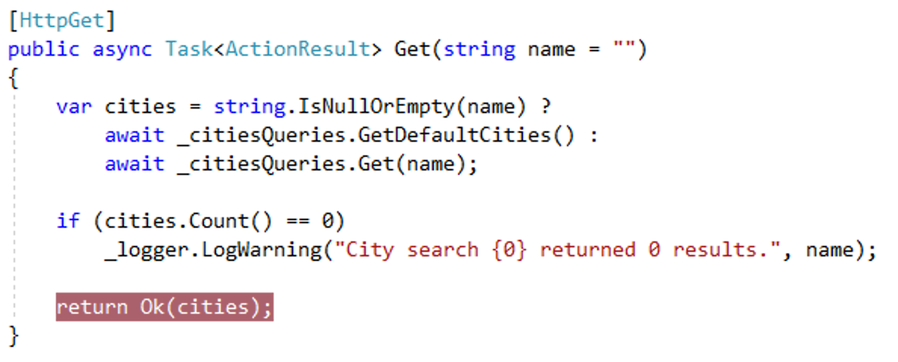

## Azure Kuberenetes Service and Azure Dev Spaces

To see how the original demo was executed, take a look at the video with Scott Hanselman and Scott Guthrie. This 5-minute video walks through how AKS and Azure Dev Spaces make developing and debugging apps with Kubernetes easier than ever. 

<a target="_blank" href="https://www.youtube.com/watch?v=rd0Rd8w3FZ0&feature=youtu.be&t=8890"></a>

## Demo Steps

Below you'll find the steps to walk through the demo on your own. Please feel free to use the Issues link above to submit any issues you encounter, suggestions that might improve the flow, or ideas on augmenting the demo. 

## How to use this script

Below, you'll see each step of the demo presented with three components - an image showing what should be on screen for the audience, what steps you should be taking during this segment of the demo, and the talk track. Here's an example step:

---

1. Select **default** from the namespace menu.
1. Wait for the container list to refresh. 


> Talk track: The bug is happening in our production web site, which is running in the **default** namespace in the AKS Cluster. I'll select **default** from the namespace menu to filter the list to only those running in the default namespace, so I can look at the logs from the microservices running in production. I could also select the **scott** namespace here if Scott needed help debugging something in his own Dev Space. 

---

### Demo Scenario

In this demo, the presenter is a new developer working for SmartHotel360, a hotel company, who has been assigned a bug to fix in a huge AKS cluster with a variety of microservices written in Node.js. .NET Core, and Java. The developer is armed with a few pre-written queries to see logs and CPU usage, and a short description of a defect in the company's web site. 

1. Open the web site in a browser. If you do not have one web site up and running, you can follow the instructions to create one in the Website repository. You can find the link to the Website repository in the [main page](../../Readme.md).
1. Search for **New** (note the capitalization) using the city search feature on the public web site. 

    

    > **Talk track:** I'm a new developer with a bug. I work for a hotel company, and our customers can search for a few cities, but we've noticed that most cities aren't showing up any more. The phrase `New` returns some matches. 

1. Search for **Sea** or **Seattle** to demonstrate that no results are found. 

    

    > **Talk track:** But when I search for `Seattle`, I don't see anything, and I know we have hotels in Seattle. I've been assigned this bug, and given a few pointers on where to get the code and that it's running in **Azure Kubernetes Service**. 

1. Flip to the AKS overview page for the demo cluster. 

    

    > **Talk track:** I'll flip over to the Azure portal to take a look at this AKS cluster in more detail. Maybe I can find something in the portal that'll help me figure out how to fix the bug. The **AKS Overview** page gives me a quick snapshot of how the cluster's operating, but I'll need to go a little deeper. Maybe this **Health** link will help. 

1. Click the **Health** link in the portal.

    

    > **Talk track:** The AKS Health Dashboard gives me a holistic snapshot of all the services running in the AKS cluster. At a glance, I can see that there are a *lot* of microservices running in here. I see a lot of system services when I'm looking at the nodes view - everything from how my app's containers are running all the way down to how the Kubernetes components and Azure Dev Spaces containers are running. 

1. Click the **Containers** navigation item in the toolbar to switch to Container view. 

    

    > **Talk track:** All I care about right now is the code I need to fix, and I've been told the production code is running in the **default** namespace. So I'm going to look at the containers in the default namespace. 

1. Select **default** from the namespace menu.

    

    > **Talk track:** The bug is happening in our production web site, which is running in the **default** namespace in the AKS Cluster. I'll select **default** from the namespace menu to filter the list to only those running in the default namespace.

1. Select **hotels** from the service menu. 

    

    > **Talk track:** Some teammates told me the service that drives the city menu on the home page is the **hotels** API, so I'll filter to that using the service menu.

1. Click on the **View Logs** link for the **Hotels** service. 

    

    > **Talk track:** AKS gives me the ability to drill right in on a a specific container running in production right from within the Azure portal. Now I can view the logs for that specific container. 

1. Wait for the default query to run. 
1. If no results are shown in the results pane, increase the parameter for the `ago` method to a greater dureation, like `ago(24)` for the past 24 hours of log data. 

    

    > **Talk track:** In seconds I'm already looking at the logs for a specific microservice in the portal, and I can see this is probably the service where the bug originates just by looking at the logs. 
    
1. Expand one of the "*City search returned 0 results*" log entries. 

    

    > **Talk track:** These log entries are a good clue providing evidence this is where the bug's happening, but I can get even deeper. Other log entries in the view show me which ASP.NET MVC Controller are dropping in those "0 results" log entries. 

1. Expand one of the `CitiesController` log entries. 

    

    > **Talk track:** I can see from the Log Search that the exact class performing the logging is the `CitiesController` class. Now I know right where to look in the source code.

    > Finding the source of this bug only took me seconds. Seems like a good time to procrastinate, so let's use some of the saved queries I have here to look around a little. 

1. Expand the **Saved Queries** in the **Query Explorer** in the Azure portal, and click the **CPU over time** query. 

    

    > **Talk track:** If I run this **CPU over time** query, for example.

1. Click the **Run** button. 

    

    > **Talk track:** The query results with a time chart showing me the CPU utilization of the container over a time slice. 

1. Click on the **Logs** query. 
1. Click the Run button.
    
    

    > **Talk track:** This query shows me the logs with the "returned 0 results" string, which we've already identified as the source of the bug. This last query might give me a more friendly view of the frequency of the failing search. 

1. Click on the **Logs Chart** query. 
1. Click the Run button.
    
    

    > **Talk track:** The AKS container dashboard and Log Search really gives me deep visibility into what's happening in each service in the cluster. Before I even look in the code, I know exactly where to look, what's happening, and how often the issue is occurring all from the logs. 

1. Flip over to Visual Studio, where the solution should be open. 
    
    

    > **Talk track:** Now I'll flip over to Visual Studio, where I've got the solution open. You can see from the Solution Explorer that there's a 1-to-1 mapping of projects to services running in my cluster. In fact, there are other services running Node.js, Java, and other languages in the cluster; what we see here is only the .NET Core services I have running. 

    > That's a lot of code, but luckilly I can use Visual Studio's world-class productivity features like code navigation and type search to find what I'm looking for in this huge solution - the `CitiesController` class. 

1. Hit `Ctrl-T` to open the Visual Studio `Go to all` search pane. 
1. Type `CitiesController`.
1. Find the `CitiesController` class and click on it. 
    
    

    > **Talk track:** Here's the CitiesController class. Now I can take a look at the `Get` method to see if I can tell what's wrong. Looks like the previous developer is making two calls to the `GetDefaultCities` method here. I'll use **Go to Definition** to see what that method's doing. 

1. Right-click the `GetDefaultCities` method and select `Go to Definition`. 

    

    > **Talk track:** It looks like the previous developer is calling the same method twice. That could be it!

1. Scroll up to show the `Get` method. 
    
    

    > **Talk track:** Looks like the `GetDefaultCities` method returns a static list. The list doesn't contain Seattle, so that explains why it isn't showing up. If I look up above this method, I see that the `Get` method is the one that actually uses Entity Framework to query the database. 
    
1. Find the line of code in `CitiesController` using the `Where` method:

    ```csharp
    _citiesQuery.GetDefaultCities().Result
        .Where(city => city.Name.StartsWith(name));
    ```

1. Change the code to match this:

    ```csharp
    await _citiesQuery.Get(name);
    ```

    

    > **Talk track:** Now that I've got the code edited, I'd like to debug it to make sure it works. I'll set my breakpoint right here on the line of code in the controller when the results are returned. 

1. Add a breakpoint on the `return Ok(cities);` line of code. 

    

    > **Talk track:** I'm ready to try this out, but who knows what'll happen when I hit F5. It would seem I would need to set up all the databases, services, all of it, or at least get a copy of the AKS cluster on my machine or somewhere else so I won't impact production - or teammates. 

    > This could take hours, or days, to set up and get working properly. I don't want to spend two weeks building a copy of the production environment - **I want to add value - and code - right away and fix this issue and be a productive member of the team**. 
    
    

1. Right-click the `SmartHotel.Services.Hotels` Visual Studio project. 
1. Select **Properties** from the flyout menu. 

    > **Talk track:** Luckilly, that's exactly what **Azure Dev Spaces**, which you get by installing the **Kubernetes Tools for Visual Studio**, can do for me. Without setting up anything, I can select Dev Spaces to use when I want to debug my code. Then, a copy of my service is deployed into AKS, and commands will be routed to that copy of the service. That way, I can debug my code changes **in my own space** without impacting either the production environment **or** my teammates, all of whom may have code running in their own Azure Dev Spaces. 

1. Select **Debug** in the left navigation. 
1. Select **Azure Dev Spaces** from the Profile menu. 

    

    > **Talk track:** Here I'll specify that I want to use Azure Dev Spaces as my debugging target. Next, I'll create my own space for my code to run in during my debugging session. 

1. Click the **Change** button. 
1. Select the AKS Cluster you want to use. 
1. Select **Create New Space** from the Space menu. 

    

    > **Talk track:** It's as easy as creating a new space in which my code will run. I'll do that here, then when I hit F5 my code will run in AKS in my own Dev Space. 
    
    

    > **Talk track:** Here I'll give my space a name. Seems like teammates are using their first names, so I'll follow suit. 

1. Enable the **Launch browser** checkbox.
1. Paste in the URL of the site (this should be the web site's public URL running in your cluster).
1. Prefix the URL with the name of the space and `.s.` so that the format is `http://{yourspace}.s.{original URL}`. 

    

    > **Talk track:** By putting in the name of my space with a `.s.` prior to the original URL, all the HTTP calls to the Hotels REST API will be routed to the container running in my own personal Dev Space. 

1. Select **Azure Dev Spaces** from the debug menu. 

    

    > **Talk track:** Before I run the debugger, I'll make sure to select **Azure Dev Spaces** from the debugging menu. 

1. Hit F5 to start the debugger (or click the toolbar button in Visual Studio). 
    
    

    > **Talk track:** Now I'll hit F5. When I do, a ton of stuff will happen - the app will be compiled, then built into a Docker image. That image will then be published up into AKS and initialized in a namespace named with my Azure Dev Space name. Then, the browser will open to the public web site. The URL of the site will include a prefix, however, that will be passed through when REST API calls are made to the Hotels API. Since that prefix is coming through on the URL, Dev Spaces knows that means to route traffic to the Hotels container running in my personal dev space, where I've got the debugger attached. 

1. Once the site opens, zoom in on the URL to show the Dev Space prefix. 
1. Scroll down and search for **Seattle** in the city search box. 
1. In a moment, Visual Studio should obtain focus and the debugger should stop on the line with the breakpoint. 
    
    

    > **Talk track:** Now, when I do the search, the HTTP call will be sent to an instance of the Hotels service I'm actively debugging. I can see the code running in the debugger, and all the watches and locals show up. I can see right away that the search hit the database and found a result for "Seattle." 

    > I can hit F5 again to let the code continue running. 
    
    

    > **Talk track:** Now, the search is working. I'm ready to commit my code, and I was able to find and fix my bug in minutes. 

    > You see can see that with Azure Kubernetes Service, developers will get the best end-to-end experience in the industry for building apps in containers using Kubernetes. Using the Container Health Monitoring you’ll have deep telemetry on how the code is running in your AKS cluster. 

    > When issues arise, you’ll use the integrated Kubernetes Tools for Visual Studio and Azure Dev Spaces to build and debug your applications in your own spaces, without messing with teammate or production code, and without having to spend days getting up and running. 
